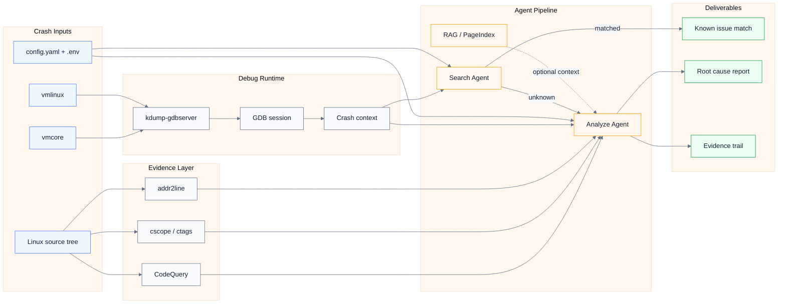

<h1 align="center">agent4kdump</h1>

<p align="center">
  <strong>面向 Linux kernel <code>vmcore</code> 的智能崩溃分析工作台</strong>
</p>

<p align="center">
  将 <code>kdump-gdbserver</code>、GDB、源码索引、已知问题检索和 LLM Agent 串联起来，
  把一次 kernel crash dump 转换成可复核的结构化分析报告。
</p>

<p align="center">
  <a href="#quick-start"></a>
  <a href="#installation"></a>
  <a href="#desktop-client"></a>
  <a href="#requirements"></a>
  <a href="#license"></a>
</p>

<p align="center">
  <a href="#features">Features</a> ·
  <a href="#quick-start">Quick Start</a> ·
  <a href="#configuration">Configuration</a> ·
  <a href="#cli-usage">CLI</a> ·
  <a href="#desktop-client">Desktop Client</a> ·
  <a href="#troubleshooting">Troubleshooting</a>
</p>

---

`agent4kdump` 面向真实 Linux 内核崩溃分析场景。它以 `vmcore`、`vmlinux` 和内核源码为核心输入，优先检索 syzbot、CVE、patch、邮件列表等公开线索；如果没有命中已知问题，再由 Analyze Agent 结合 GDB 上下文、源码证据和可选 RAG 经验库输出根因判断。

这个项目更接近一个本地分析工作台，而不是简单的脚本集合：命令行适合自动化和调试，桌面客户端适合管理多次分析会话、上传 `vmcore`、校验配置并查看报告。

## Contents

- [Features](#features)
- [Architecture](#architecture)
- [Requirements](#requirements)
- [Installation](#installation)
- [Quick Start](#quick-start)
- [Configuration](#configuration)
- [CLI Usage](#cli-usage)
- [Desktop Client](#desktop-client)
- [Build Client](#build-client)
- [Repository Layout](#repository-layout)
- [Output](#output)
- [Troubleshooting](#troubleshooting)
- [Security Notes](#security-notes)
- [Contributing](#contributing)
- [License](#license)

## Features

| 能力 | 说明 |
| --- | --- |
| Crash runtime | 基于 `vmcore`、`vmlinux` 和 `kdump-gdbserver` 启动可交互调试环境 |
| GDB evidence | 通过 GDB / GDB-MI 提取调用栈、寄存器、crash report 和源码位置 |
| Source indexing | 结合 CodeQuery、`cscope`、`ctags`、`addr2line` 做源码证据定位 |
| Known-bug search | 检索 syzbot、CVE、patch、邮件列表等公开信息，优先确认已知问题 |
| Root-cause agent | 对未知 crash 输出根因、触发路径、修复建议、置信度和验证 TODO |
| RAG / PageIndex | 可选接入历史分析经验，提升相似问题复用能力 |
| Desktop workflow | React + Tauri 客户端支持配置校验、会话管理、`vmcore` 上传和报告查看 |

## Architecture



## Requirements

推荐在 Linux 或 WSL 中运行完整分析流程。Windows 可以用于编辑代码和部分前端开发，但真实 `vmcore` 分析依赖 Linux 调试工具链。

| 类型 | 要求 |
| --- | --- |
| Python | Python 3.13+、`uv` |
| Debugging | `gdb` 或 `gdb-multiarch`、`addr2line`、`kdump-gdbserver` |
| Source index | `cscope`、`ctags`、CodeQuery 的 `cqmakedb` / `cqsearch` |
| Kernel input | Linux 内核源码、已编译的 `vmlinux`、待分析的 `vmcore` |
| Agent services | 可用的 LLM API Key；网页检索需要 Tavily API Key |
| Desktop client | Node.js、npm、Rust、Cargo、Tauri Linux 原生依赖 |

内核源码建议先在源码根目录生成 GDB 辅助脚本：

```bash
cd /path/to/linux
make V=1 scripts_gdb
```

## Installation

克隆仓库并安装 Python 依赖：

```bash
git clone https://github.com/enlist12/agent4kdump.git
cd agent4kdump
uv sync
```

准备本地配置文件：

```bash
cp .env.example .env
cp config.example.yaml config.yaml
```

如果使用仓库内的 kdump 运行库，运行前加载环境：

```bash
source kdump_analyze/env.sh
```

如果需要重新构建 `kdump-gdbserver`，参考 [kdump_analyze/kdump.md](kdump_analyze/kdump.md)，准备并编译：

- `libkdumpfile`
- `kdump-gdbserver`
- `pykdumpfile`

## Quick Start

1. 填写 `.env` 中的模型和检索密钥。
2. 修改 `config.yaml`，指向本机内核源码、`vmcore` 和调试工具。
3. 先执行 dry run，确认路径和工具链可用。
4. 运行完整分析。

```bash
uv run python main.py --dry-run
uv run python main.py
```

使用其他配置文件：

```bash
uv run python main.py --config /path/to/config.yaml
```

## Configuration

### Environment Variables

`.env` 用于存放模型、搜索和可观测性相关配置。不要提交真实 `.env`。

```dotenv
API_KEY=your_llm_api_key
MODEL_NAME=gpt-4o
MODEL_PROVIDER=openai
LLM_BASE_URL=

TAVILY_API_KEY=your_tavily_key

LANGFUSE_SECRET_KEY=
LANGFUSE_PUBLIC_KEY=
LANGFUSE_HOST=https://cloud.langfuse.com

PAGEINDEX_API_KEY=
OPENAI_API_KEY=
OPENAI_API_BASE=
```

| 变量 | 用途 |
| --- | --- |
| `API_KEY` | 主 LLM API Key |
| `MODEL_NAME` | 分析使用的模型名称 |
| `MODEL_PROVIDER` | 模型供应商标识 |
| `LLM_BASE_URL` | 自定义模型服务地址，可为空 |
| `TAVILY_API_KEY` | Search Agent 网页检索 |
| `LANGFUSE_*` | 可选 Langfuse 追踪 |
| `PAGEINDEX_API_KEY` | 可选 PageIndex / RAG 能力 |
| `OPENAI_API_KEY`、`OPENAI_API_BASE` | RAG 或兼容 OpenAI 接口时使用 |

### Analysis Config

`config.yaml` 用于存放本地路径和分析开关。

```yaml
linux_path: /path/to/linux
gdb_path: auto
vmcore: /path/to/vmcore
kdump_server: auto
syzbot_data: ./data
enable_rag: false
build_codequery: true
rag_cache_dir: ./cache/rag
kdump_host: 127.0.0.1
kdump_port: 1234
kdump_args: []
```

| 字段 | 默认值 | 说明 |
| --- | --- | --- |
| `linux_path` | `./kernel/linux` | Linux 内核源码根目录，目录下必须有 `vmlinux` |
| `gdb_path` | `auto` | `gdb` 路径；`auto` 会从环境变量和 `PATH` 查找 |
| `vmcore` | `./vmcore` | 待分析的 crash dump 文件 |
| `kdump_server` | `auto` | `kdump-gdbserver` 路径；`auto` 会优先查找仓库内置路径和 `PATH` |
| `syzbot_data` | `./data` | 本地 syzbot 数据目录，保留给搜索增强使用 |
| `enable_rag` | `false` | 是否启用 RAG / PageIndex |
| `build_codequery` | `true` | 初始化时是否构建 CodeQuery 数据库 |
| `rag_cache_dir` | `./cache/rag` | RAG 缓存目录 |
| `kdump_host` | `127.0.0.1` | 本地 kdump 调试服务地址 |
| `kdump_port` | `1234` | 本地 kdump 调试服务端口 |
| `kdump_args` | `[]` | 传给 `kdump-gdbserver` 的额外参数 |

## CLI Usage

| 命令 | 说明 |
| --- | --- |
| `uv run python main.py --dry-run` | 校验配置并打印摘要，不启动调试器 |
| `uv run python main.py` | 使用默认 `config.yaml` 运行完整分析 |
| `uv run python main.py --config /path/to/config.yaml` | 指定配置文件 |
| `uv run python main.py --confirm` | 打印配置后要求人工确认 |
| `uv run python main.py --no-codequery` | 本次运行跳过 CodeQuery 构建 |

## Desktop Client

桌面端由三部分组成：

- `client/app/`：React + Vite 前端
- `client/backend/`：本地 FastAPI 服务
- `client/src-tauri/`：Tauri 桌面壳

开发模式需要先启动 API，再启动前端：

```bash
uv run uvicorn client.backend.app:app --host 127.0.0.1 --port 8000
```

```bash
cd client
npm install
npm run dev
```

然后访问 Vite 输出的本地地址，通常是 `http://127.0.0.1:5173`。

客户端典型流程：

1. 在 Settings 中填写或加载 `.env`。
2. 创建分析会话。
3. 填写 `linux_path`、`vmcore`、`gdb_path`、`kdump_server` 等配置。
4. 点击 Validate 校验配置。
5. 点击 Run 启动分析。
6. 查看事件流、结果摘要和 Markdown 报告。

`vmcore` 可以直接填写服务端路径，也可以通过客户端上传。上传文件会保存到：

```text
cache/client_uploads/vmcore/<upload_id>/
```

Tauri 桌面开发模式：

```bash
cd client
npm run desktop:dev
```

Tauri 启动时会优先连接 `127.0.0.1:8000`；如果没有现成 API 服务，会尝试启动打包后的后端；开发检出环境下也会回退到 `uv run uvicorn client.backend.app:app --host 127.0.0.1 --port 8000`。

## Build Client

Linux / WSL 下构建桌面客户端：

```bash
cd client
npm run build:linux
```

等价方式：

```bash
bash client/scripts/build-linux.sh
```

构建产物会复制到仓库根目录 `dist/`：

```text
dist/agent4kdump-client-linux-x64
dist/agent4kdump-client-linux-x64.AppImage
dist/agent4kdump-client-linux-x64.deb
```

如果构建失败，优先检查 Tauri 原生依赖、Rust toolchain、Node.js、npm 和 `uv`。

## Repository Layout

```text
.
|-- main.py                    # CLI entrypoint
|-- log.py                     # logging setup
|-- pyproject.toml             # Python project metadata and dependencies
|-- uv.lock                    # locked Python dependency graph
|-- config.example.yaml        # safe analysis config template
|-- .env.example               # safe environment variable template
|-- agent4kdump-backend.spec   # PyInstaller backend spec
|-- client/                    # React + FastAPI + Tauri desktop client
|   |-- app/                   # React + Vite UI
|   |-- backend/               # local FastAPI service
|   |-- shared/                # shared contracts and docs
|   |-- scripts/               # client build scripts
|   `-- src-tauri/             # Tauri desktop shell
|-- docs/                      # design notes and module docs
|-- kdump_analyze/             # kdump runtime and helper scripts
|-- scripts/                   # auxiliary scripts
`-- src/
    `-- agents/                # agents, tools, RAG, kdump and GDB utilities
```

## Output

命令行和客户端都会围绕同一套分析结果输出：

| 输出 | 说明 |
| --- | --- |
| Configuration Summary | 当前使用的内核源码、`vmcore`、GDB、kdump 和 RAG 配置 |
| PageIndex Status | RAG / PageIndex 初始化状态 |
| Known Bug Search Result | 是否命中已知问题、查询记录、证据和匹配链接 |
| Root Cause Analysis Result | 根因、触发路径、修复建议、置信度、关键位置和验证 TODO |
| Report Markdown | 桌面客户端生成的 Markdown 报告 |

根因分析阶段的核心字段包括：

- `root_cause`
- `trigger_path`
- `fix_suggestion`
- `confidence`
- `crash_site`
- `key_locations`
- `patch_sketch`
- `evidence`
- `verification_todo`

## Troubleshooting

| 现象 | 处理 |
| --- | --- |
| `Required runtime inputs are missing` | 检查 `config.yaml` 中的路径和可执行文件 |
| 找不到 `gdb` | 把 `gdb_path` 改成绝对路径，或确保 `gdb` 在 `PATH` 中 |
| 找不到 `kdump-gdbserver` | 把 `kdump_server` 改成绝对路径，或执行 `source kdump_analyze/env.sh` |
| `vmlinux-gdb.py` 缺失 | 在内核源码根目录执行 `make V=1 scripts_gdb` |
| CodeQuery 首次构建慢 | 首次索引内核源码是预期行为；临时跳过可用 `--no-codequery` |
| Search Agent 无法联网检索 | 检查 `TAVILY_API_KEY` 和网络环境 |
| RAG 初始化失败 | 先把 `enable_rag` 改为 `false`，确认基础分析流程可运行后再启用 |
| 客户端无法连接后端 | 确认 `uv run uvicorn client.backend.app:app --host 127.0.0.1 --port 8000` 正在运行 |

## Documentation

- [client/README.md](client/README.md)
- [docs/module_design/design.md](docs/module_design/design.md)
- [docs/module_design/tools.md](docs/module_design/tools.md)
- [docs/module_design/RAG.md](docs/module_design/RAG.md)
- [docs/search-analyze-rag-improvement-notes.md](docs/search-analyze-rag-improvement-notes.md)
- [docs/workflow-tree-api-design.md](docs/workflow-tree-api-design.md)
- [docs/taint-analysis-tree-design.md](docs/taint-analysis-tree-design.md)

## Security Notes

- 不要提交真实 `.env`、API Key、私有 `vmcore`、客户内核源码或内部 crash 报告。
- `vmcore` 可能包含敏感内存内容，上传、缓存和报告导出前应先确认脱敏策略。
- LLM / Search / RAG 供应商可能接收分析上下文，生产使用前应确认数据边界。
- `cache/`、`dist/`、`.venv/`、`node_modules/`、本地配置和构建产物不应进入版本库。

## Contributing

当前项目仍处于工程验证和快速迭代阶段。提交修改前建议至少完成：

```bash
uv run python main.py --dry-run
```

涉及桌面客户端时，建议额外执行：

```bash
cd client
npm run build:web
```

贡献时请优先保持以下原则：

- 配置示例必须可公开提交，不包含真实密钥和私有路径。
- 文档中的命令应能对应到仓库中的实际脚本或入口。
- 分析逻辑修改需要说明对 Search Agent、Analyze Agent 或 RAG 输出结构的影响。
- 不要提交 `vmcore`、内核源码、缓存目录、依赖目录或构建产物。

## Third-Party Dependencies

This project builds on the following open-source components:

| Component | Upstream | Role |
| --- | --- | --- |
| kdump-gdbserver | <https://codeberg.org/ptesarik/kdump-gdbserver> | GDB remote debug server for kernel vmcore inspection |
| libkdumpfile | <https://codeberg.org/ptesarik/libkdumpfile> | Library for accessing kernel crash dump files |
| pykdumpfile | <https://codeberg.org/ptesarik/pykdumpfile> | Python bindings for libkdumpfile |

Build instructions for these components can be found in [kdump_analyze/kdump.md](kdump_analyze/kdump.md).

## License

This project is licensed under the [GNU General Public License v3.0](LICENSE).
